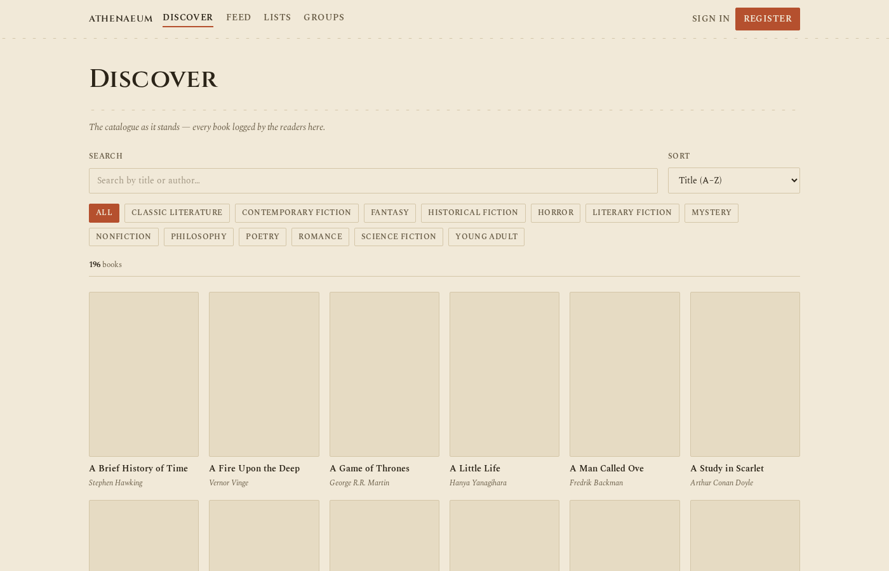
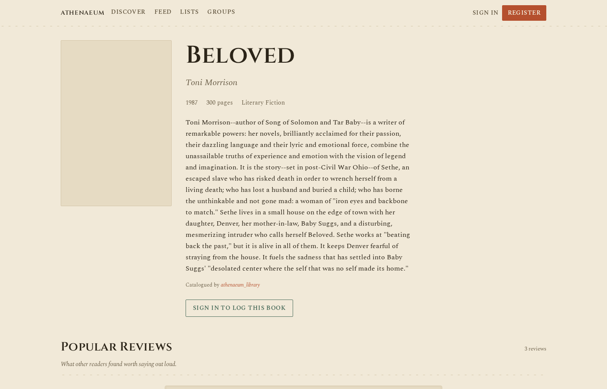
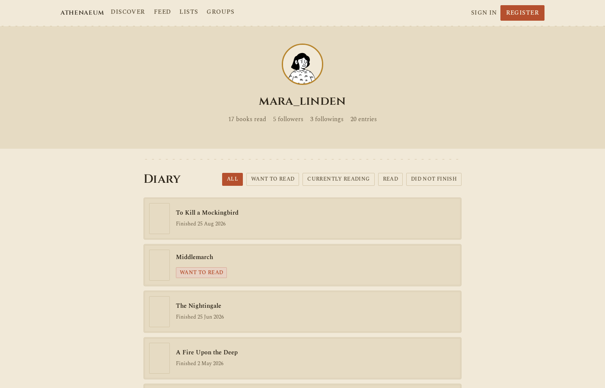
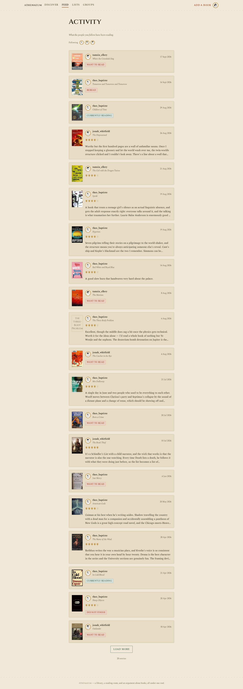
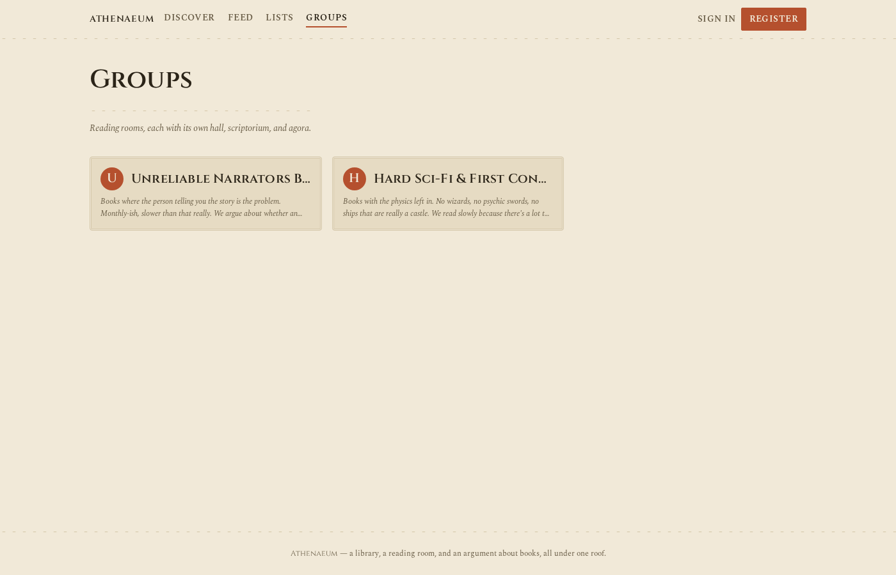

# Athenaeum

A Letterboxd for books. You log what you read, rate it, write about it if you
want to, and see what the people you follow are reading. There are reading
groups too, with group chat and live audio rooms, like a Substack chat crossed
with a book club.

I built this to learn FastAPI properly — auth, a real database, the whole
backend of a real app — and then kept going because it turned out to be fun.

## What's in it

- **A catalogue of books** you can search, filter by genre, and sort. Real
  book data (covers, descriptions, page counts) pulled from Open Library.
- **Logging** — mark a book as want-to-read, currently reading, read, or
  did-not-finish, with a star rating and a written review if you want one.
- **A "similar books" section** on every book page, powered by an actual
  small machine learning model (not just "same genre") that compares books by
  their description and picks out the ones that are genuinely alike.
- **Following people** and a feed of what they've logged recently.
- **Reading lists** you can rank and add books to.
- **Groups** — join one, post in it, chat live with other members, or start a
  live audio room to talk about a book together.

## How it's built

- **Backend**: Python, FastAPI, SQLAlchemy (async), a real database
  (SQLite locally, Postgres in production), Alembic for schema migrations,
  JWT-based login.
- **Frontend**: React, Tailwind CSS.
- **Live chat**: WebSockets. **Live audio**: LiveKit.
- Backend and frontend are two separate projects, each with their own git
  history — the frontend lives in `marginalia-web/`.

## A few screenshots



*Browsing the catalogue — search, genre filters, sort.*



*A book's own page — other people's reviews, and books like it.*



*A reader's profile and their reading history.*



*A feed of what people you follow have logged.*



*Reading groups people can join and post in.*

## Running it yourself

You'll need [uv](https://docs.astral.sh/uv/) (Python) and Node installed.

Backend:

```bash
uv sync
uv run alembic upgrade head
uv run fastapi dev main.py
```

Frontend, in a separate terminal:

```bash
cd marginalia-web
npm install
npm run dev
```

Open `http://localhost:5173`. The backend runs at `http://127.0.0.1:8000`
(API docs at `/docs`).

The catalogue starts empty. Two scripts fill it in — real books, and some
fake reader accounts with real reviews and activity so the app doesn't feel
empty while you look around:

```bash
uv run python seed_books.py
uv run python seed_activity.py
```

Full guides for testing everything by hand are in `docs/TESTING.md` and
`docs/API_TESTING.md`.

## Where things stand

This is a personal project, not a finished product. It has real
authentication, a real database, migrations, and an actual (small) test
suite — but no live deployment yet, since I'm holding off until I need one.
`docs/PRODUCTION.md` has the honest list of what's left before that happens.
